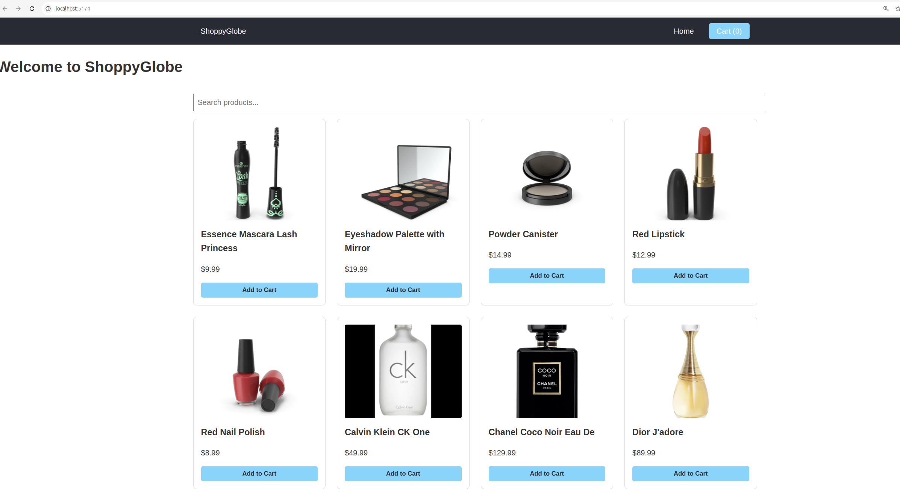
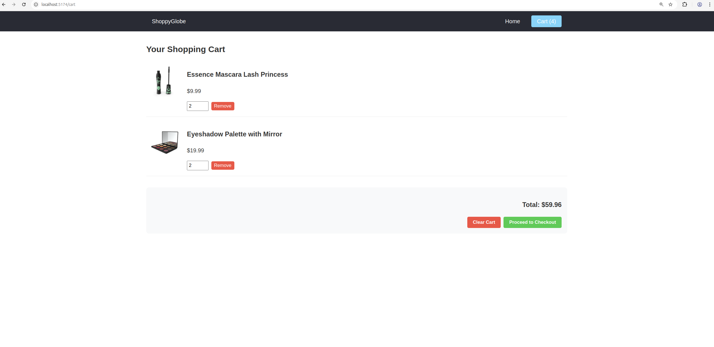

# 🛍️ ShoppyGlobe - Modern E-Commerce App

A feature-rich e-commerce application built with React, Redux, and Vite. ShoppyGlobe demonstrates modern web development practices with a complete shopping experience.

## ✨ Features

- **Product Catalog**
  - Browse products with images, prices, and ratings
  - Search and filter functionality
  - Product detail pages

- **Shopping Cart**
  - Add/remove products
  - Adjust quantities
  - Real-time total calculation

- **Modern Architecture**
  - Redux state management
  - React Router navigation
  - Responsive design
  - API data fetching
  - Code splitting with React.lazy